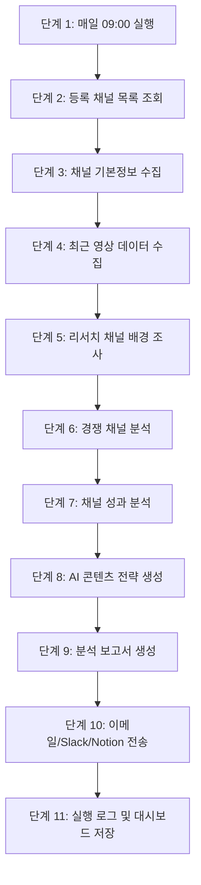
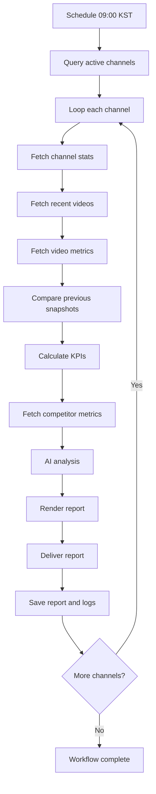
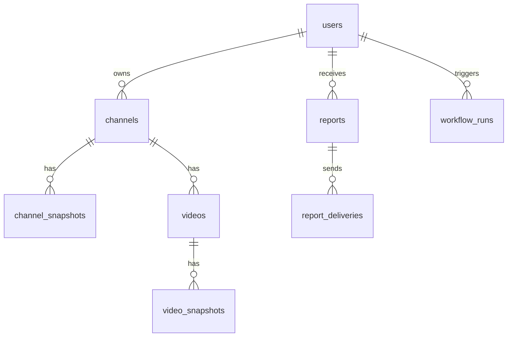

# PRD: 매일 아침 유튜브 채널 자동 분석 AI Agent 서비스

문서 목적: Cursor, Claude, Codex, Lovable, v0 등 AI 개발 자동화 도구에게 바로 작업을 지시할 수 있도록 제품 요구사항, 워크플로우, 데이터 모델, 화면, API, n8n 자동화 구조, 인수기준을 명확히 정의한다.

제품명 가칭: **Channel Morning Brief**

## 1. 제품 개요

사용자가 분석하고 싶은 YouTube 채널을 등록하면, 시스템이 매일 오전 09:00에 채널 데이터를 수집하고 AI로 성과와 콘텐츠 전략을 분석한 뒤 이메일, Slack, Notion, 대시보드로 일일 보고서를 전달하는 서비스다.

### 핵심 가치

- 여러 YouTube 채널을 매일 자동 모니터링한다.
- 조회수, 구독자, 업로드, 영상별 성과, 댓글 반응, 경쟁 채널 변화를 한 번에 요약한다.
- AI가 채널 성장 요인, 콘텐츠 패턴, 다음 영상 아이디어, 위험 신호를 분석한다.
- 사용자는 매일 아침 보고서만 확인하면 된다.

## 2. MVP 범위

### 포함

- 사용자가 YouTube 채널 URL, 핸들, 채널 ID를 등록한다.
- 채널별 활성/비활성, 태그, 경쟁 채널 그룹을 관리한다.
- 매일 오전 09:00 KST에 자동 분석을 실행한다.
- YouTube Data API v3로 채널/영상/통계 데이터를 수집한다.
- 최근 7일, 28일, 전일 대비 성과 변화를 계산한다.
- LLM으로 일일 보고서, 콘텐츠 전략, 이상 징후, 액션 아이템을 생성한다.
- 이메일 발송을 기본으로 하고 Slack/Notion 전송은 선택 기능으로 둔다.
- 대시보드에서 최근 보고서와 채널별 지표를 확인한다.

### 제외 또는 후순위

- 완전한 댓글 감성 분석 대량 처리
- 영상 자막 전체 다운로드 및 장문 요약
- 썸네일 이미지 멀티모달 분석
- 유료 결제/구독 관리
- 팀 권한 관리 고도화
- YouTube Studio 비공개 지표 연동

## 3. 사용자 시나리오

1. 사용자는 웹서비스에 로그인한다.
2. `채널 등록` 화면에서 YouTube 채널 URL 또는 핸들을 입력한다.
3. 시스템은 채널 ID, 채널명, 썸네일, 구독자 수, 총 조회수, 업로드 수를 확인한다.
4. 사용자는 보고서 수신 채널을 선택한다. 기본값은 이메일이다.
5. 매일 오전 09:00에 n8n 워크플로우가 실행된다.
6. 시스템은 등록된 채널과 경쟁 채널 데이터를 수집한다.
7. 시스템은 성과 변화와 콘텐츠 패턴을 분석한다.
8. AI가 보고서를 생성한다.
9. 사용자는 이메일/Slack/Notion/대시보드에서 보고서를 확인한다.

## 4. 전체 워크플로우

첨부 이미지의 단계형 워크플로우를 확장한 구조다.



## 5. n8n 워크플로우 상세 설계

### 5.1 노드 구성

| 단계 | n8n 노드 | 역할 | 입력 | 출력 |
|---:|---|---|---|---|
| 1 | Schedule Trigger | 매일 오전 09:00 KST 실행 | cron | run_id |
| 2 | DB: Get Active Channels | 활성 채널 목록 조회 | users, channels | channel list |
| 3 | Split In Batches | 채널별 반복 처리 | channel list | single channel |
| 4 | HTTP: YouTube channels.list | 채널 기본 통계 조회 | channel_id | subscriber/view/video count |
| 5 | HTTP: YouTube search.list 또는 playlistItems.list | 최근 업로드 영상 목록 조회 | uploads playlist_id | video ids |
| 6 | HTTP: YouTube videos.list | 영상별 통계/길이/게시일 조회 | video ids | video metrics |
| 7 | DB: Load Previous Snapshots | 전일/7일/28일 이전 데이터 조회 | channel_id | baseline metrics |
| 8 | Code: Calculate Metrics | 증감률, 평균, 랭킹 계산 | current + previous | analytics JSON |
| 9 | HTTP/DB: Competitor Data | 경쟁 채널 데이터 조회 | competitor group | competitor metrics |
| 10 | AI Agent: Channel Analyst | 성과 요약, 원인 추정, 전략 생성 | analytics JSON | report JSON |
| 11 | Template: HTML Report | HTML/Markdown 보고서 렌더링 | report JSON | report HTML |
| 12 | Email Send | 일일 보고서 발송 | recipient, HTML | delivery status |
| 13 | Slack/Notion Optional | 선택 채널 전송 | report summary | delivery status |
| 14 | DB: Save Report & Logs | 보고서, 실행 로그 저장 | all results | report_id |
| 15 | Error Trigger | 실패 알림 | error | admin alert |

### 5.2 n8n 실행 흐름



### 5.3 스케줄 정책

| 항목 | 기본값 |
|---|---|
| 실행 시간 | 매일 09:00 |
| 시간대 | Asia/Seoul |
| 재시도 | 실패 시 10분 간격 3회 |
| API 호출 제한 | 채널당 최근 30개 영상 기본 |
| 보고서 기준 | 전일, 최근 7일, 최근 28일 |
| 실패 알림 | 관리자 이메일 또는 Slack |

## 6. 분석 지표

### 6.1 채널 지표

- 구독자 수
- 총 조회수
- 총 영상 수
- 신규 업로드 수
- 전일 대비 구독자 증가량
- 전일 대비 총 조회수 증가량
- 최근 7일 업로드 빈도
- 최근 28일 평균 조회수

### 6.2 영상 지표

- 영상 제목
- 게시일
- 조회수
- 좋아요 수
- 댓글 수
- 영상 길이
- 조회수 증가량
- 참여율: `(좋아요 + 댓글) / 조회수`
- 업로드 후 24시간/48시간 성과. YouTube API로 과거 스냅샷이 저장된 경우 계산 가능하다.

### 6.3 경쟁 채널 지표

- 동일 카테고리 경쟁 채널 업로드 수
- 경쟁 채널 상위 영상
- 제목/키워드 패턴
- 업로드 요일/시간 패턴
- 내 채널 대비 조회수 격차
- 내 채널 대비 참여율 격차

## 7. AI 보고서 구성

매일 보고서는 아래 구조로 생성한다.

1. 오늘의 핵심 요약
2. 채널별 성과 변화
3. 신규 업로드 영상 성과
4. 급상승 영상 또는 이상 징후
5. 경쟁 채널 주요 변화
6. 콘텐츠 주제/제목/썸네일 인사이트
7. 다음 영상 아이디어 5개
8. 오늘 실행할 액션 아이템
9. 리스크 및 확인 필요 사항

### 7.1 AI 출력 JSON 스키마

```json
{
  "reportDate": "2026-07-01",
  "summary": "string",
  "channels": [
    {
      "channelId": "string",
      "channelName": "string",
      "headline": "string",
      "metrics": {
        "subscriberDelta": 0,
        "viewDelta": 0,
        "newVideoCount": 0,
        "avgViews7d": 0,
        "engagementRate": 0
      },
      "wins": ["string"],
      "risks": ["string"],
      "recommendedActions": ["string"]
    }
  ],
  "competitorInsights": ["string"],
  "contentIdeas": [
    {
      "title": "string",
      "rationale": "string",
      "targetAudience": "string",
      "expectedImpact": "high|medium|low"
    }
  ],
  "dataWarnings": ["string"]
}
```

## 8. 화면 요구사항

### 8.1 로그인/설정

- 이메일 로그인 또는 소셜 로그인
- YouTube API 키 등록 상태 표시
- 보고서 수신 이메일 설정
- Slack Webhook URL, Notion API 설정은 선택 입력

### 8.2 채널 관리

- 채널 URL/핸들 입력
- 채널 자동 식별
- 채널명, 썸네일, 구독자 수 미리보기
- 분석 활성/비활성 토글
- 태그 입력
- 경쟁 채널 그룹 지정

### 8.3 대시보드

- 오늘 보고서 카드
- 채널별 구독자/조회수 변화
- 최근 업로드 영상 Top 10
- 급상승/급락 알림
- 경쟁 채널 비교표

### 8.4 보고서 상세

- HTML/Markdown 보고서 보기
- 원본 데이터 JSON 보기
- 이메일 재발송
- Notion으로 다시 보내기
- 보고서 다운로드

## 9. 데이터 모델

Postgres/Supabase 기준이다.



### 9.1 주요 테이블

| 테이블 | 주요 필드 |
|---|---|
| users | id, email, timezone, report_time, created_at |
| channels | id, user_id, youtube_channel_id, handle, title, thumbnail_url, active, tags, created_at |
| channel_snapshots | id, channel_id, collected_at, subscriber_count, view_count, video_count |
| videos | id, channel_id, youtube_video_id, title, published_at, duration, thumbnail_url |
| video_snapshots | id, video_id, collected_at, view_count, like_count, comment_count |
| competitor_groups | id, user_id, name |
| competitor_channels | id, group_id, youtube_channel_id, title |
| reports | id, user_id, report_date, report_json, html, markdown, status, created_at |
| report_deliveries | id, report_id, channel_type, recipient, status, sent_at, error_message |
| workflow_runs | id, user_id, started_at, ended_at, status, error_message |

## 10. API 요구사항

### 10.1 채널 등록

`POST /api/channels`

```json
{
  "urlOrHandle": "https://www.youtube.com/@channel",
  "tags": ["AI", "교육"],
  "active": true
}
```

### 10.2 채널 목록

`GET /api/channels`

### 10.3 보고서 목록

`GET /api/reports?date=2026-07-01`

### 10.4 보고서 재생성

`POST /api/reports/{reportId}/regenerate`

### 10.5 n8n 내부 실행 Webhook

`POST /api/internal/workflow/youtube-daily-report`

주의: 내부 API는 `N8N_SHARED_SECRET`으로 인증한다.

## 11. 환경변수

```bash
DATABASE_URL=
SUPABASE_URL=
SUPABASE_SERVICE_ROLE_KEY=
YOUTUBE_API_KEY=
OPENAI_API_KEY=
GOOGLE_GEMINI_API_KEY=
RESEND_API_KEY=
SLACK_WEBHOOK_URL=
NOTION_API_KEY=
N8N_BASE_URL=
N8N_SHARED_SECRET=
APP_BASE_URL=
DEFAULT_TIMEZONE=Asia/Seoul
```

## 12. AI 프롬프트 초안

### 12.1 시스템 프롬프트

```text
너는 YouTube 채널 성장 전략 분석가다.
입력으로 채널 통계, 영상 통계, 전일/7일/28일 비교 데이터, 경쟁 채널 데이터를 받는다.
사실과 추정을 구분하고, 데이터로 확인되지 않은 내용은 "확인이 필요하다"라고 표시한다.
보고서는 한국어로 작성한다.
마케팅 과장 표현보다 실행 가능한 액션을 우선한다.
반드시 지정된 JSON 스키마로만 출력한다.
```

### 12.2 사용자 프롬프트

```text
아래 JSON 데이터를 분석하여 일일 YouTube 채널 보고서를 생성하라.

분석 기준:
1. 전일 대비 변화
2. 최근 7일 성과
3. 최근 28일 추세
4. 신규 업로드 영상 반응
5. 경쟁 채널 대비 차이
6. 다음 콘텐츠 전략

입력 데이터:
{{analytics_json}}
```

## 13. 인수기준

### 13.1 기능 인수기준

- 사용자는 YouTube 채널 URL 또는 핸들로 채널을 등록할 수 있다.
- 시스템은 등록된 채널의 채널 ID를 자동 식별한다.
- 매일 09:00 KST에 활성 채널 분석이 자동 실행된다.
- 각 실행 결과는 DB에 저장된다.
- 보고서는 이메일로 발송된다.
- n8n 실행 실패 시 관리자에게 알림이 간다.
- 보고서에는 채널별 요약, 성과 지표, 경쟁 분석, 액션 아이템이 포함된다.

### 13.2 품질 인수기준

- 한 사용자당 10개 채널 기준 5분 이내 분석 완료
- YouTube API 실패 시 실패 채널만 재시도
- LLM 응답 실패 시 기본 템플릿 보고서라도 생성
- 보고서 생성 결과는 재현 가능한 원본 JSON과 함께 저장
- 민감한 API 키는 클라이언트에 노출하지 않음

## 14. 개발 작업 분해

### 14.1 Cursor/Codex용 백엔드 작업

```text
이 PRD를 기준으로 Next.js 15 + TypeScript + Supabase 기반 웹서비스를 구현하라.
우선 MVP만 구현한다.
필수 구현:
1. Supabase 스키마와 migration 작성
2. 채널 등록 API
3. 채널 목록 API
4. 보고서 목록/상세 API
5. n8n 내부 Webhook API
6. YouTube API 클라이언트
7. 보고서 저장 로직
8. 환경변수 예시 파일
9. 기본 테스트
코드는 보안상 API 키가 클라이언트로 노출되지 않게 작성하라.
```

### 14.2 Lovable/v0용 UI 작업

```text
이 PRD를 기준으로 SaaS 관리자 웹 UI를 생성하라.
페이지:
1. 대시보드
2. 채널 관리
3. 채널 등록 모달
4. 보고서 목록
5. 보고서 상세
6. 설정
디자인:
- 업무용 분석 도구 느낌
- 카드, 표, 필터, 상태 배지 중심
- 모바일에서도 깨지지 않게 반응형
- 첫 화면은 마케팅 랜딩이 아니라 실제 대시보드
```

### 14.3 Claude용 분석/문서 작업

```text
이 PRD를 검토하여 누락된 요구사항, 리스크, 데이터 정책, YouTube API 쿼터 이슈, 보고서 품질 기준을 보강하라.
출력:
1. 보완 요구사항 목록
2. 리스크 표
3. API 쿼터 절감 전략
4. 보고서 품질 평가 루브릭
```

### 14.4 n8n 구현 작업

```text
이 PRD의 n8n 워크플로우 상세 설계를 기준으로 n8n workflow JSON을 생성하라.
조건:
1. Schedule Trigger는 매일 09:00 Asia/Seoul
2. Supabase 또는 Postgres에서 active channel 목록 조회
3. Split In Batches로 채널별 처리
4. YouTube Data API v3 HTTP Request 구성
5. Code 노드로 KPI 계산
6. LLM 노드로 report_json 생성
7. HTML 보고서 템플릿 생성
8. Email 발송
9. DB에 report와 workflow_run 저장
10. 실패 시 Error Trigger 또는 별도 알림 경로 포함
Credential 값은 placeholder로 둔다.
```

## 15. 운영 리스크와 대응

| 리스크 | 설명 | 대응 |
|---|---|---|
| YouTube API quota 초과 | 채널과 영상 수가 많으면 호출량 증가 | 최근 30개 영상 제한, 캐시, 스냅샷 재사용 |
| 채널 ID 식별 실패 | 핸들/URL 형식 다양 | URL 정규화 함수와 검색 fallback 구현 |
| LLM 환각 | 데이터에 없는 원인 단정 | JSON 원본 기반, 확인 필요 표시 강제 |
| 보고서 품질 불안정 | 매일 문체/구조 달라짐 | 출력 JSON 스키마와 템플릿 렌더링 분리 |
| 이메일 스팸 처리 | 매일 자동 발송 | 발신 도메인 인증, 제목 규칙, 수신 설정 |
| 개인정보/키 노출 | API 키 관리 부실 | 서버 전용 환경변수, RLS, secret scan |

## 16. MVP 완료 정의

MVP는 다음 상태가 되면 완료로 본다.

- 채널 3개 이상 등록 가능
- 매일 09:00 자동 실행 가능
- 최근 영상 30개 기준 분석 가능
- 전일 대비 변화 계산 가능
- AI 보고서 생성 가능
- 이메일 발송 가능
- 대시보드에서 최근 보고서 확인 가능
- 실패 실행 로그 확인 가능

